# Priced — Architecture

This document explains how the entire Priced product works, from the moment a tweet appears on your screen to the moment a trade executes on Solana.

---

## Table of Contents

- [System Overview](#system-overview)
- [How a Tweet Becomes a Trade](#how-a-tweet-becomes-a-trade)
- [Chrome Extension](#chrome-extension)
- [Matching Backend](#matching-backend)
- [Actions Server (Solana Blinks)](#actions-server-solana-blinks)
- [Web App & Portfolio Dashboard](#web-app--portfolio-dashboard)
- [Data Pipeline](#data-pipeline)
- [Key Numbers](#key-numbers)
- [File Map](#file-map)

---

## System Overview

Priced is made up of four services that work together:

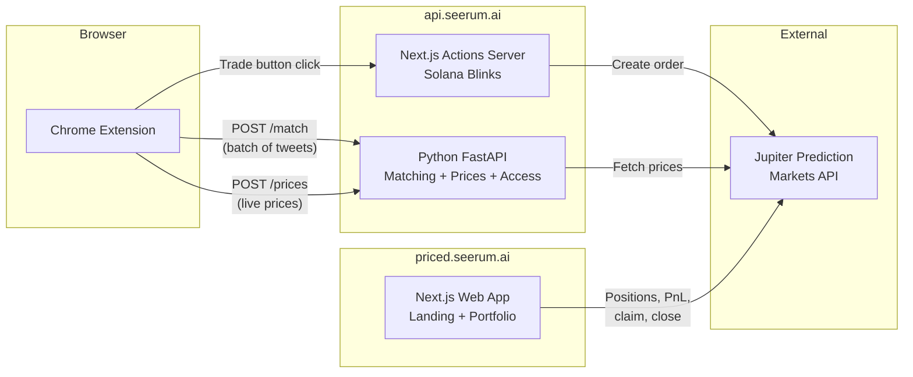

| Service | Tech | Where it runs | What it does |
|---------|------|---------------|--------------|
| **Chrome Extension** | TypeScript + esbuild | User's browser | Detects tweets, shows market cards, links to trades |
| **Matching Backend** | Python FastAPI + ONNX | api.seerum.ai | Embeds tweets, matches to markets, serves prices |
| **Actions Server** | Next.js | api.seerum.ai | Implements Solana Blinks protocol for one-click trading |
| **Web App** | Next.js 16 | priced.seerum.ai | Landing page + wallet-gated portfolio dashboard |

---

## How a Tweet Becomes a Trade

This is the full journey from seeing a tweet to executing a trade:

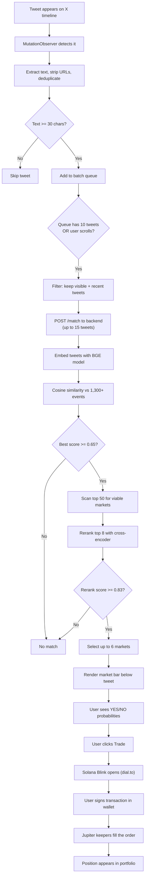

---

## Chrome Extension

The extension runs as a content script on x.com and twitter.com. It has four main jobs:

### Tweet Detection

A `MutationObserver` watches the page for new tweets. When one appears:

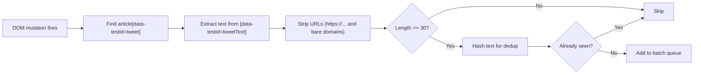

- **Selector**: `article[data-testid="tweet"]` for tweets, `[data-testid="tweetText"]` for text
- **URL stripping**: Removes `https://...` and bare domain patterns to reduce noise
- **Deduplication**: Simple JS hash stored in a `Set` (per session, cleared on refresh)
- **Minimum length**: 30 characters after cleaning

### Smart Batching

Tweets are queued and sent in batches for efficiency. The queue flushes on two triggers:

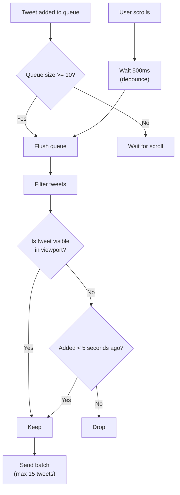

| Constant | Value | Purpose |
|----------|-------|---------|
| `BATCH_SIZE` | 10 | Queue size that triggers immediate flush |
| `MAX_BATCH_SIZE` | 15 | Hard ceiling per API call |
| `FLUSH_DELAY_MS` | 500ms | Scroll debounce delay |
| `TWEET_MAX_AGE_MS` | 5,000ms | Max age for invisible tweets before dropping |
| IntersectionObserver threshold | 0.3 | 30% visible = "in viewport" |

**Visibility prioritization**: An `IntersectionObserver` tracks which tweets are currently on screen. When flushing, visible tweets are always included. Off-screen tweets older than 5 seconds are dropped — the user has scrolled past them.

**Pause/resume**: The popup UI can pause the queue via `chrome.storage`. When paused, `flush()` returns immediately. The queue still fills but nothing is sent.

### Market Bar Rendering

When a match comes back from the backend, a market card is injected below the tweet:

**Binary markets** (single YES/NO outcome):
- Collapsed: shows title + YES/NO probability percentages
- Expanded: shows trade buttons with prices in cents

**Multi-outcome markets** (e.g., "Who wins the election?"):
- Collapsed: shows event title + outcome count
- Expanded: lists each outcome with individual YES/NO trade buttons

**Price formatting**:
- Backend returns prices in micro-USD (1,000,000 = $1.00)
- Display formula: `cents = Math.round(microUsd / 10000)`
- Example: 650,000 micro-USD = 65 cents = "YES 65%"

**Trade URLs (Solana Blinks)**:
```
https://dial.to/?action=solana-action:{encoded-action-url}
```
Where the action URL is:
```
https://api.seerum.ai/api/actions/trade/{marketId}?amount=2000000&side=yes
```

**Live price refresh**: When a user expands a card, fresh prices are fetched from the backend. A 10-second debounce prevents excessive API calls. Updated prices flash briefly with a CSS animation.

**Virtual scroll handling**: X.com detaches and reattaches tweet DOM elements as you scroll. If a tweet element goes stale, the extension re-finds it by matching text content against live DOM nodes.

### Access Code Flow

The extension is invite-only. Here's how access works:

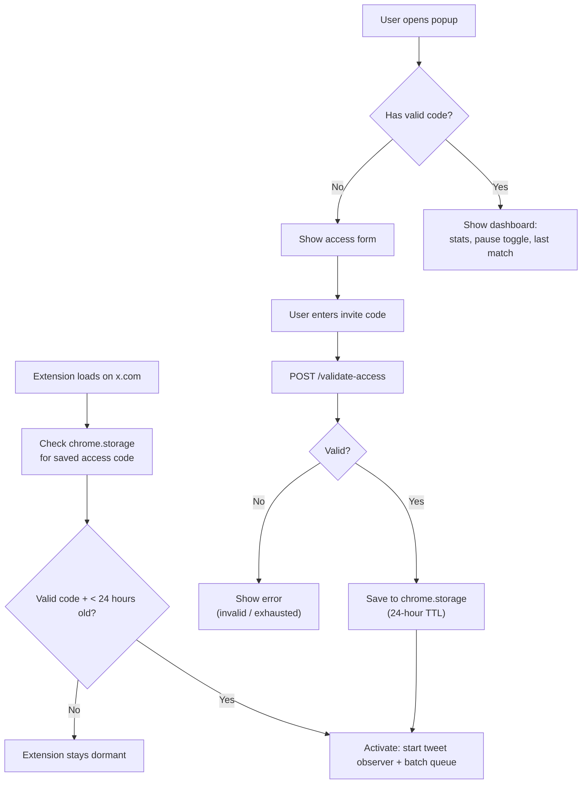

- Codes are validated against a SQLite database on the backend
- Each validation atomically increments a usage counter
- Codes can have a max usage limit (0 = unlimited)
- The 24-hour TTL means the extension re-validates daily without incrementing the counter again

---

## Matching Backend

The backend is a Python FastAPI server that does the heavy lifting: embedding tweets, matching them to prediction market events, and serving live prices.

### The Embedding Model

**Model**: BAAI/bge-base-en-v1.5 (768-dimensional embeddings)

The model turns text into a list of 768 numbers (a "vector"). Similar texts produce similar vectors. This is how we match tweets to events without keyword matching.

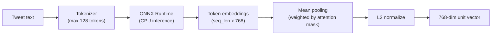

- **ONNX Runtime**: Runs on CPU, no GPU needed. ~400MB smaller than the full PyTorch stack
- **Batch processing**: Multiple tweets are embedded in a single model call
- **Max tokens**: 128 (tweets are short, this is plenty)

### The Matching Algorithm

This is the core of the product. It takes a tweet embedding and finds the best matching event:

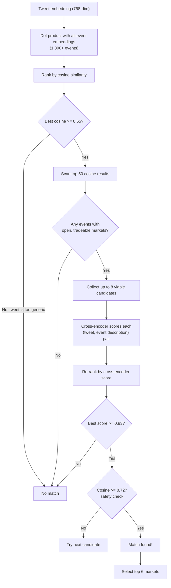

**Why two stages?**
- **Cosine similarity** is fast (one matrix multiply) but can be fooled by similar-sounding but unrelated topics
- **Cross-encoder reranking** is slower but much more accurate — it reads the tweet and event description together and scores how well they match
- The cosine gate (0.65) filters out junk early so the expensive reranker only runs on promising candidates

**What makes a market "viable"?**
- Status is open (not resolved/closed)
- Price is between 3 cents and 97 cents (not a foregone conclusion)
- Close time hasn't passed

**Fallback**: If the reranker model isn't available, the system falls back to cosine-only matching with a threshold of 0.75.

### Market Selection

Once an event is matched, we pick which markets (outcomes) to show:

1. **Filter**: Only open markets with prices between 3 cents and 97 cents
2. **Sort by uncertainty**: Markets closest to 50 cents (50/50) are the most interesting to trade
3. **Return top 6**: At most 6 outcomes shown in the market bar
4. **Fallback**: If no markets pass the price filter, fall back to any open market with pricing

### The Reranker

**Model**: Alibaba-NLP/gte-reranker-modernbert-base (quantized ONNX)

The reranker is a cross-encoder — it takes a (tweet, event description) pair and outputs a score between 0 and 1. Unlike the embedding model which encodes texts independently, the cross-encoder reads both texts together, which gives it much better understanding of whether they actually match.

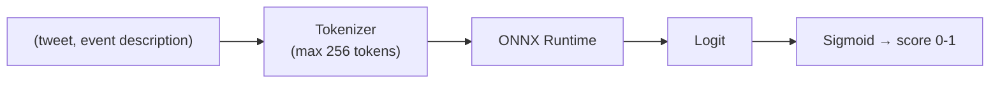

- Processes up to 8 candidates in a single batch
- Threshold: 0.83 (high bar to prevent false positives)
- Optional: If the model fails to load, the system gracefully falls back to cosine-only matching

### API Endpoints

| Endpoint | Method | What it does |
|----------|--------|-------------|
| `/match` | POST | Match a batch of tweets to prediction market events |
| `/prices` | POST | Fetch live prices for up to 6 market IDs from Jupiter |
| `/market/{marketId}` | GET | Get details for a single market |
| `/validate-access` | POST | Validate an invite code (atomic increment) |
| `/health` | GET | Health check (event count, model info) |
| `/reload` | POST | Hot-reload market data without restart |
| `/admin` | GET | Admin dashboard for managing access codes |

---

## Actions Server (Solana Blinks)

The actions server implements the [Solana Actions Protocol](https://docs.dialect.to/documentation/actions/actions) so users can trade directly from Blinks without leaving X.

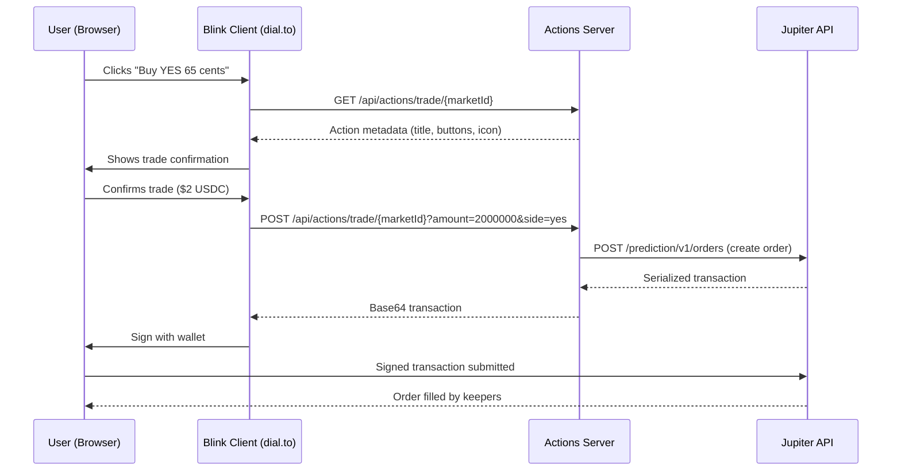

**Key details**:
- Default trade amount: $2 USDC (users can enter custom amounts)
- USDC mint: `EPjFWdd5AufqSSqeM2qN1xzybapC8G4wEGGkZwyTDt1v`
- Jupiter keepers fill the order after the user signs — it's not instant but typically takes a few seconds
- The actions server is stateless — it just proxies between the Blink client and Jupiter's API

---

## Web App & Portfolio Dashboard

**Repo**: [saurrx/priced-landing](https://github.com/saurrx/priced-landing)
**Live at**: [priced.seerum.ai](https://priced.seerum.ai)

The web app is a separate Next.js application with two main pages:

### Landing Page (`/`)
Product landing page with interactive demo showing how the extension works.

### Portfolio Dashboard (`/portfolio`)
A wallet-gated dashboard where users connect their Solana wallet to:

- **View positions** — All active, settled, and claimable prediction market positions in one place
- **Track PnL** — Interactive chart showing realized profit/loss over 24h, 1 week, or 1 month
- **Portfolio summary** — Total portfolio value, unrealized PnL, win rate, and claimable winnings
- **Claim winnings** — One-click claim for settled positions that resolved in your favor
- **Close positions** — Exit active positions early at current market price
- **Trade history** — Full timeline of all orders, fills, payouts, and position updates

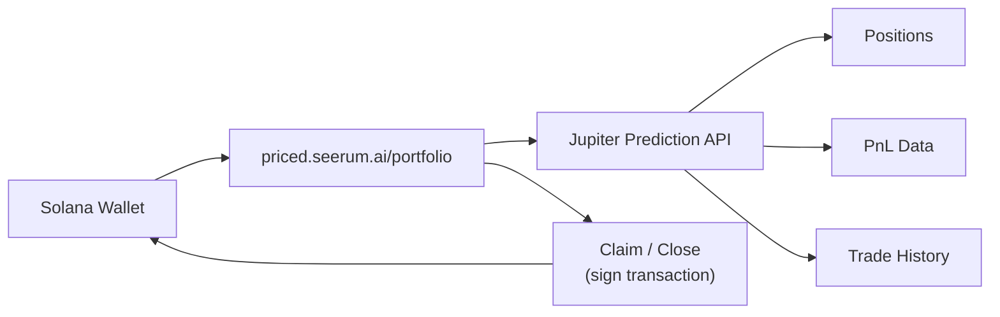

**Tech stack**: Next.js 16, React 19, Tailwind CSS 4, Solana wallet-adapter-react, SWR, Recharts, Framer Motion

---

## Data Pipeline

Market data needs to stay fresh. A daily sync pipeline fetches the latest markets from Jupiter, filters them, and generates new embeddings:

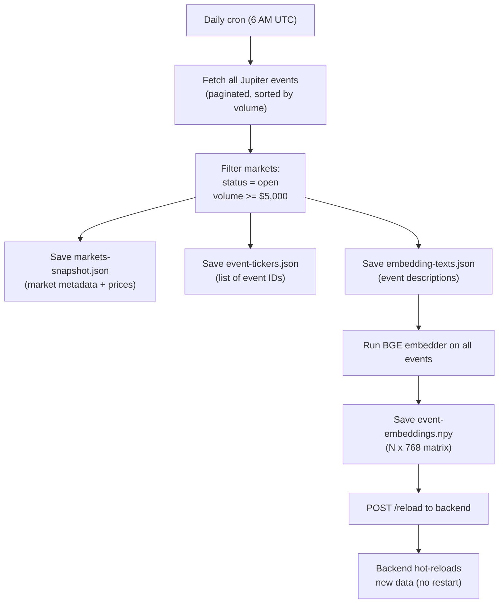

**The sync command**:
```bash
npm run sync
# Runs: npx tsx scripts/ingest-jupiter.ts && cd server && python3 generate_embeddings.py
```

**Ingestion details**:
- Fetches from Jupiter API v1, paginated (20 events/page, 5 concurrent fetches)
- Early termination: stops after 3 consecutive pages with zero qualifying markets
- Rate limit handling: exponential backoff on HTTP 429
- Volume threshold: $5,000 USD minimum (filters out illiquid markets)

**Deployment**: PM2 manages three processes:
1. `python-backend` — FastAPI on port 8000
2. `actions-server` — Next.js on port 3000
3. `jupiter-sync-cron` — Daily sync at 6 AM UTC

---

## Key Numbers

### Matching Thresholds

| Parameter | Value | What it controls |
|-----------|-------|-----------------|
| `cosine_gate` | 0.65 | Minimum cosine score to even consider a tweet (rejects generic text) |
| `cosine_scan` | 50 | How many top cosine results to scan for viable markets |
| `rerank_top_n` | 8 | Max viable candidates to pass to the cross-encoder |
| `rerank_threshold` | 0.83 | Minimum cross-encoder score to confirm a match |
| `min_match_cosine` | 0.72 | Safety check: cosine must be at least this even after reranking |
| `threshold` (cosine-only) | 0.75 | Fallback threshold when reranker is unavailable |

### Market Viability

| Parameter | Value | Meaning |
|-----------|-------|---------|
| Min price | 30,000 micro-USD (3 cents) | Below this, the outcome is nearly certain NO |
| Max price | 970,000 micro-USD (97 cents) | Above this, the outcome is nearly certain YES |
| Ideal price | 500,000 micro-USD (50 cents) | Markets sorted by closeness to 50/50 |
| Max markets returned | 6 | Per matched event |

### Extension Constants

| Constant | Value | Purpose |
|----------|-------|---------|
| `BATCH_SIZE` | 10 | Tweets per batch (flush trigger) |
| `MAX_BATCH_SIZE` | 15 | Hard ceiling per API call |
| `FLUSH_DELAY_MS` | 500ms | Scroll debounce |
| `TWEET_MAX_AGE_MS` | 5,000ms | Drop invisible tweets older than this |
| `MIN_TWEET_LENGTH` | 30 chars | Minimum tweet length after URL stripping |
| `ACCESS_VALIDATION_TTL_MS` | 24 hours | How long an access code stays valid locally |
| Price refresh debounce | 10 seconds | Cooldown between live price fetches per card |

### Models

| Model | Dimensions | Size (ONNX) | Purpose |
|-------|-----------|-------------|---------|
| BAAI/bge-base-en-v1.5 | 768 | ~200 MB | Text embedding (tweets + events) |
| Alibaba-NLP/gte-reranker-modernbert-base | N/A | ~100 MB | Cross-encoder reranking |

---

## File Map

```
priced/
├── extension/                        # Chrome extension
│   ├── manifest.json                 # Extension manifest (MV3)
│   ├── popup.html                    # Popup UI (access form + dashboard)
│   ├── popup.css                     # Popup styles
│   ├── dist/                         # Built JS (committed, no build needed)
│   │   ├── content.js                # Content script bundle
│   │   └── popup.js                  # Popup script bundle
│   ├── src/
│   │   ├── config.ts                 # All constants and URLs
│   │   ├── types.ts                  # TypeScript interfaces
│   │   ├── popup.ts                  # Popup logic (access + dashboard)
│   │   ├── content/
│   │   │   ├── index.ts              # Entry point, access check, activation
│   │   │   ├── tweet-observer.ts     # DOM observation, text extraction
│   │   │   └── market-bar.ts         # Market card rendering, Blink URLs
│   │   └── matching/
│   │       ├── api-client.ts         # HTTP client for backend
│   │       └── batch-queue.ts        # Batching, visibility, flush logic
│   ├── styles/
│   │   └── market-bar.css            # Injected market card styles
│   └── icons/                        # Extension icons (16, 48, 128px)
│
├── server/                           # Python matching backend
│   ├── main.py                       # FastAPI app, all endpoints
│   ├── matcher.py                    # Matching algorithm + market selection
│   ├── embedder.py                   # BGE ONNX embedding model
│   ├── reranker.py                   # GTE cross-encoder reranker
│   ├── access_db.py                  # SQLite access code management
│   ├── generate_embeddings.py        # Script to generate event embeddings
│   └── data/
│       ├── markets-snapshot.json     # Market metadata (daily refresh)
│       ├── event-tickers.json        # Event ID list
│       ├── embedding-texts.json      # Event descriptions for reranker
│       ├── event-embeddings.npy      # Pre-computed embeddings (N x 768)
│       ├── model.onnx                # BGE model (gitignored)
│       ├── reranker-model.onnx       # GTE model (gitignored)
│       └── access_codes.db           # SQLite database
│
├── actions-server/                   # Solana Blinks server
│   └── src/app/api/actions/
│       └── trade/[marketId]/
│           └── route.ts              # GET (metadata) + POST (transaction)
│
├── scripts/
│   └── ingest-jupiter.ts             # Market data ingestion from Jupiter
│
├── docs/
│   └── ARCHITECTURE.md               # This file
│
├── ecosystem.config.cjs              # PM2 deployment config
└── README.md                         # Install guide + overview
```

**Separate repo**: [saurrx/priced-landing](https://github.com/saurrx/priced-landing) — Web app + portfolio dashboard at priced.seerum.ai
